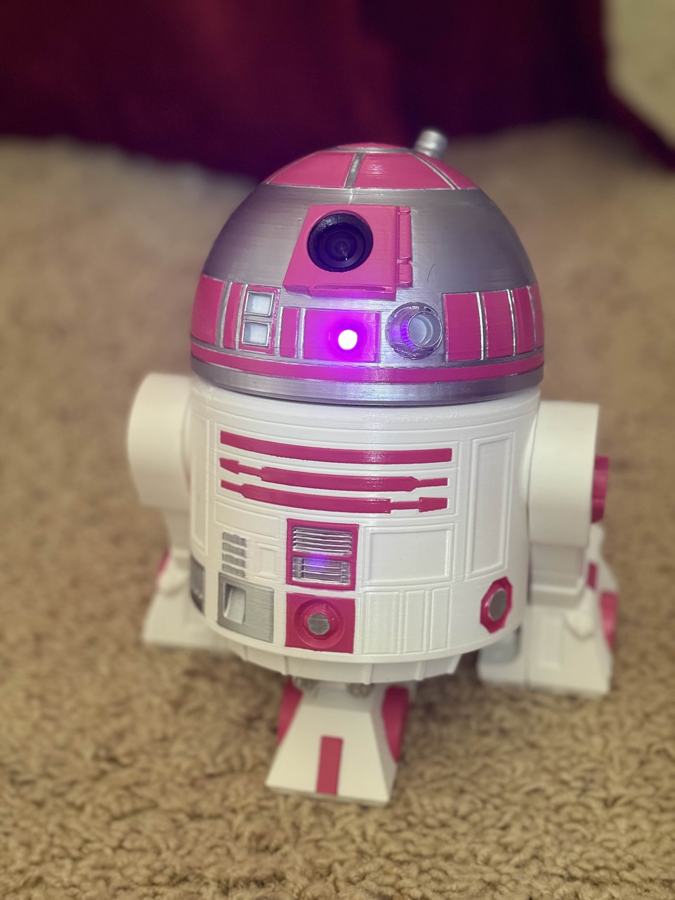

# QT-P1: Audio-Video Mini Astromech Droid

    
    

<!-- TODO: make thumbnail image -->

> [Alexia Giselle Eugenio](https://www.linkedin.com/in/alexia-eugenio/) and [Raymond Wong](https://www.linkedin.com/in/raymond-exe/)  
> May 2025 - June 2025  

**QT Prototype 1:** A custom Star Wars mini astromech droid, featuring realtime video and playable sound effects. Chasis based on Baddeley's BB-R2 and styled after R2-KT. You can view the full project repository [here](https://github.com/Raymond-exe/astromech).

**Project status:** Complete

----------

## Project Overview

The QT Prototype 1 (QT-P1) Mini Astromech is a small (< 1 ft.) RC droid, controlled over Wi-Fi from a smartphone. The droid's main computer is a Raspberry Pi Zero 2 W, setup as a Wi-Fi hotspot to allow user control even without internet access. When the droid *is* connected to another (parent) network, all devices connected to the hotspot also gain access to the internet.

The smartphone receives live video from the dome-mounted camera, can play pre-set sound effects from the droid's speaker, and can control its movements from a mobile browser (tested with Safari on iOS and Chrome on Android). The droid also features an on-board microphone, though it is currently unused.

Chat-GPT was used during the early design process and software planning.

## Features
- 3D Printed Chasis
    - *[BB-R2](https://www.printed-droid.com/kb/bb-r2/) model from Mr. Baddeley*
- Live video feed
- Sound effect playback
- Rotating dome
- 2 drive servos
- Mobile browser control page (tested on Safari & Chrome)
- Mobile hotspot
    - Shares internet access if the droid itself is also connected to a network.

## 3D-Printed Components

*Almost* all 3D-printed parts for this project are either modified from or are directly from Mr. Baddeley's BB-R2 mini droid kit, and must be downloaded from his [Patreon page](https://www.patreon.com/c/mrbaddeley).

All modifications made to Mr. Baddeley's droid parts:
- Modeled a hole in the Astromech dome's eye to fit the camera.
- Modeled 1 front-dome LED hole.
- Modeled 1 rear-dome LED hole.
- Modeled small indents inside the dome to glue magnets for hats.
- Modeled a hole in the main body's back panel to fit a charging port.
- Drilled several speaker holes at the bottom of the body for the speaker to be mounted downward.

## Electrical System Hardware

| Component | Role | Source | Estimated Current Draw |
| --------- | ---- | ------ | ---------------------- |
| Raspberry Pi Zero 2 W | Main astromech computer | [Amazon](https://www.amazon.com/dp/B09LH5SBPS) | 0.4 - 0.6 A |
| Raspberry Pi Camera Module, wide-angle | Live video feed | [Amazon](https://www.amazon.com/dp/B083XMGSVP) | ~0.25 A |
| WM8960 Audio HAT Module | Audio IO | [Amazon](https://www.amazon.com/dp/B098R7TTM4) | ~0.05 A |
| PCA9685 Servo Driver Board | Servo motor control | [AliExpress](https://www.aliexpress.us/item/3256808620007290.html) | ~0.1 A* |
| 3x MG90S Servo Motors (continuous-rotation) | Main drive wheels, dome rotation | Donated from Rob :) | 0.4 A each (stall) |
| Geekworm X306 UPS Board | Power distribution | [Amazon](https://www.amazon.com/dp/B0B74NT38D) | |
| 18650 Battery Cell (9900mAh) | Power source | [Amazon](https://www.amazon.com/dp/B0CP5N3XMF) | |

*The PCA9685 can draw about 25mA per channel, with a maximum of 400mA. 100mA was estimated since I'm only using 3 channels, plus a little extra for safety. ([Source](https://forums.adafruit.com/viewtopic.php?t=148785))

### Additional Electrical Hardware
| Component | Source |
| --------- | ------ |
| Heatsink case for Raspberry Pi Zero 2 | [Amazon](https://www.amazon.com/dp/B0BLTZKKN9) |
| USB Type-C panel mount adapter | [Amazon](https://www.amazon.com/dp/B0D93S6C29) |
| USB Type-C 90-degree adapter | [Amazon](https://www.amazon.com/dp/B0D92JZLW8)
| LED lights | [Amazon](https://www.amazon.com/dp/B01AUI4VSI) |
| Light-up momentary switch | [Amazon](https://www.amazon.com/dp/B0DN13M5PF) |

## Software
The Astromech's software uses [Flask](https://github.com/pallets/flask) to create the webpage interfaces for mobile browsers. All client-droid interactions go through Flask, including touch inputs, the live video stream, and sound effect playback.

### Auto-updates
The [GitHub repository](https://github.com/Raymond-exe/astromech) containing the Astromech code includes a [`run.sh`](https://github.com/Raymond-exe/astromech/blob/master/run.sh) script, which is run each time the Astromech's computer boots. It automatically pulls new changes from the repository, allowing it to be wirelessly updated with any software changes.

Pulling updates upon each boot allows future features, such as functionality for the microphone on the WM8960 sound card, to be added at a later date.

### Dependencies
- [WM8960 Audio HAT driver](https://github.com/ubopod/WM8960-Audio-HAT), updated for kernel 6.12
- [PiPCA9685 driver](https://github.com/barulicm/PiPCA9685)
- apt packages:
    - git
    - python3-flask
    - python3-picamera2
    - ffmpeg
    - alsa-utils

## Guides
If you're looking for how to assemble the 3D printed parts from Mr. Baddeley's BB-R2 kit, see the [BB-R2 Mechanical assembly instructions](https://www.printed-droid.com/wp-content/uploads/2020/09/BB-R2-instructions.pdf). Otherwise, feel free to look through the guides available in the [Astromech GitHub repository](https://github.com/Raymond-exe/astromech/blob/master/guides) for further info on the hardware, software, or hotspot configuration.

### Images and Media

