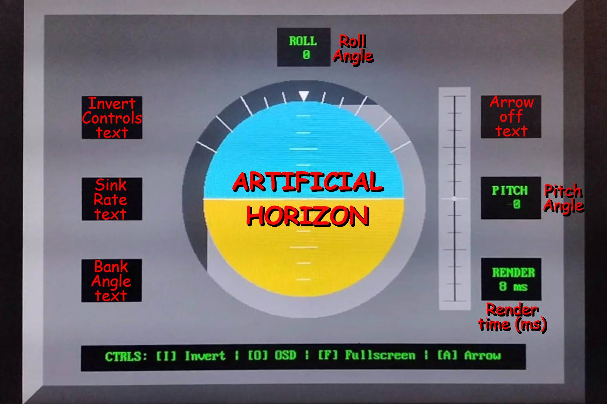
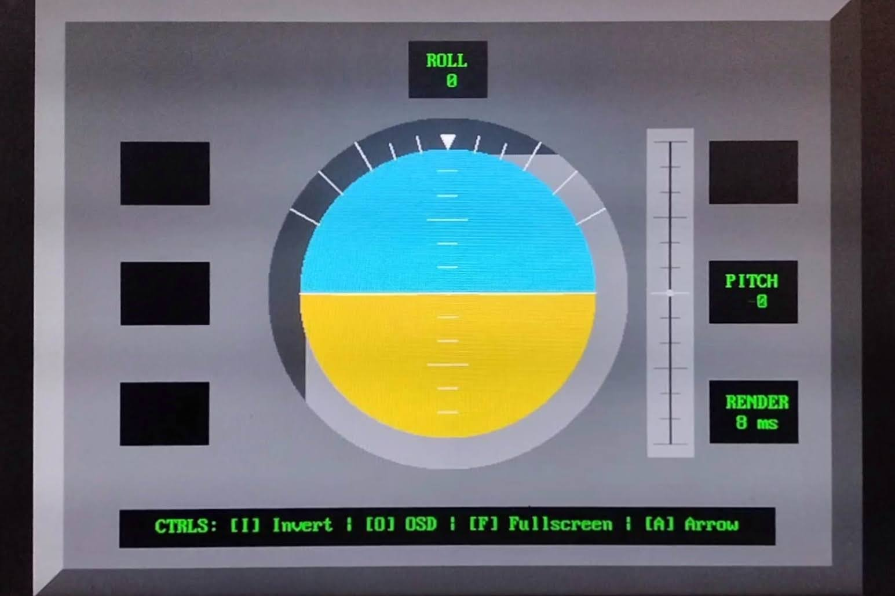

# Attitude Indicator Demonstration on an FPGA

    
    
    

 

<iframe src="https://www.youtube.com/embed/EuNLbY52PdY"></iframe>

> Rob Ranit and Raymond Wong  
> December 2024 
> ECE 4305.01 － Advanced Digital Design Using Verilog HDL

An attitude indicator implemented on the Nexys A7 FPGA, using hardware optimizations for VGA rendering.

**Project status:** Complete

## Project Abstract:

The objective of this project is to create a demonstration attitude indicator (or "artificial horizon") using the Nexys A7 FPGA's on-board accelerometer and a VGA-compatible display. Attitude indicators are a common instrument present in all modern aircraft, and provide pilots with crucial information about their aircraft's current 2 or 3-axis rotation at a glance. All attitude indicators work by displaying two colored regions (typically blue and orange) on a ball or circular display, representing the sky (up) and ground (down) respectively. For the purposes of this demonstration, the Nexys-based attitude indicator is only able to rotate in the pitch and roll axes, as there is no way to determine yaw using the Nexys's accelerometer alone. Rendering the attitude indicator onto the VGA display is achieved in layers, with each layer contributing a different element. A keyboard is then used to toggle each render layer for debugging and demonstrations, and controls can be seen below. Each render layer is also described below.

For more information on Attitude Indicators, see the related [Wikipedia Article](https://en.wikipedia.org/wiki/Attitude_indicator).

*Image from [Wikimedia Commons](https://upload.wikimedia.org/wikipedia/commons/1/1d/Attitude_Indicator.png)*

## Render Layers

### Pixel Buffer Layer
A layer rendered from a pixel buffer, which can be modified directly by software. Render times increase significantly in proportion to the number of pixels being modified. Therefore, the buffer is usually only modified when rendering the gray UI when the program first loads, and also used for rendering the small arrow at the top of the Artificial Horizon indicating the current roll. All other dynamic elements on the display are handled on other layers.

### Artificial Horizon Layer
This layer displays blue and orange regions on the display, separated by a white line. The equation of this line (in `y=mx+b` format) is defined by separate hardware registers for the `m` slope and `b` y-intercept. By using software to manipulate these two values, the blue and orange regions can shift in size and border angle to take up more or less of the display. When the `[F]` Fullscreen option is disabled, the Artificial Horizon is confined to the circle in the center.

### On-Screen Display (OSD) Layer
A grid of text characters (and other symbols) handling all text outputs on the display. Modifying the shapes for these characters allowed us to create the horizontal pitch lines at the center of the Artificial Horizon. The OSD Layer is also used to display:
- "INVRT CTRLS" text, visible when the pitch & roll controls are inverted.
- "SINK RATE" text, when the pitch exceeds 45 degrees downward.
- "BANK ANGLE" text, when the roll exceeds 45 degrees in either direction.
- "ARROW OFF" text, when the roll arrow is hidden.

### Sprite Layer
A layer used to display one or more simple sprites. This layer is only used to display the pitch indicator slider, to the right of the Artificial Horizon.

## Controls
Each layer contains logic to bypass or disable rendering for that layer. The Sprite and Artificial Horizon layers cannot be bypassed
| Key | Affected layer | Description |
| --- | --- | --- |
| `[I]` | Artificial Horizon | Inverts the pitch and roll values, and by extension the `m` slope and `b` intercept values. |
| `[O]` | On-Screen Display | Toggles visibility of all text on the screen, including the horizontal pitch lines. |
| `[F]` | Pixel Buffer | Toggles visibility of the pixel buffer layer. When hidden, only the Artificial Horizon is displayed. Does not clear the pixel buffer itself.
| `[A]` | Pixel Buffer | Toggles visibility of the arrow indicator for the roll. **Improves render times**.

## Hardware Used:
- Digilent Nexys A7 FPGA
- VGA Video Cable & Monitor
- Keyboard

## Images and Media

