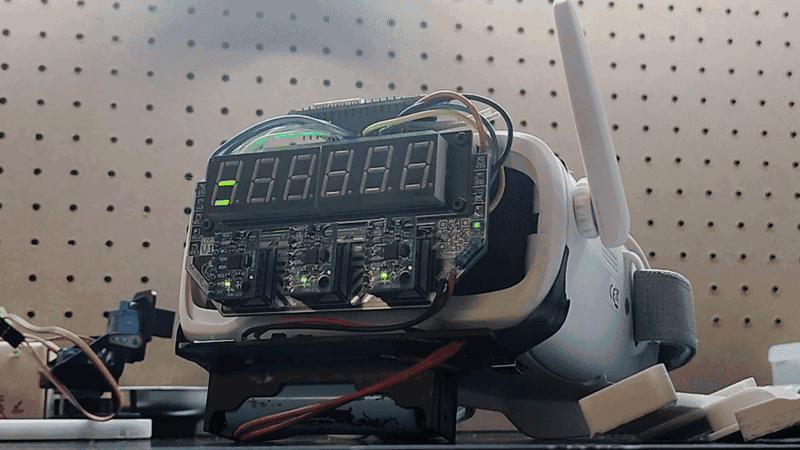

<!-- Internal Disclaimer: I am writing after waking up from anesthesia. -->

# Capstone Project: VR-analogous Camera Control System for FPV Pilots

    
    
    

 

<iframe src="https://www.youtube.com/embed/KP6AFJprnVQ"></iframe>

> *Submitted as my Engaged Learning Experience for the Kellogg Honor College, Cal Poly Pomona.*  
***Selected as a winner** at CPP's 2025 Student Research, Scholarship & Creative Activities Conference ([RSCA](https://www.cpp.edu/cppsrc/current-conference/index.shtml)).*

**Project status:** Complete

----------

## Slideshow Presentation
<iframe src="https://docs.google.com/presentation/d/1hSID1Xj82OG5c93E1Hq8MMiwoe57s5Jl8a1LDsr6gXY/embed"> </iframe>

----------

## Abstract

While first-person view (FPV) quadcopters have become popular among hobbyists, aerobatics pilots, and even advertising media teams, a notable concern when flying FPV quadcopters for low-speed navigation or precision landings is a pilot's vertical visibility of their environment. Cameras on-board FPV drones typically sit at a fixed angle which must be adjusted by hand, thus typically do not grant significant visibility directly above or below the drone while in flight. As such, gaining a visual of the ground beneath the drone or the ceiling above the drone can be quite challenging at low speeds.

To address this, a simple 2-axis gimbal was constructed out of servo motors and mounted onto the body of a standard FPV drone to rotate the on-board camera along the drone's localized pitch and yaw axis, allowing for improved spatial awareness at low speeds. Control over the servo motor gimbal is achieved remotely, from a rotation-based control system mounted onto the pilot's FPV headset display. This system allows the on-board camera gimbal to mirror the head rotations of the pilot, resulting in user interactions comparable to virtual reality technology. To track the pilot's head rotations, three inertial measurement units (IMUs) are mounted onto the headset and pass data through a Madgwick AHRS filter. The on-board camera gimbal (as well as the rotation control system) are implemented to operate almost entirely independently from the drone's core flight systems and the FPV headset display, allowing for easy uninstallation (or installation onto other drones and headsets).

----------

## Project Goals

### Minimum Viable Product Goals
- [x] Improve FPV operators' vertical awareness.
- [x] Camera rotations must feel like a natural extension of existing flight controls.
- [x] Camera rotation system must be kept independent from any critical systems, for this demonstration.
- [x] Determine the accuracy of the head-tracking system.
### Stretch Goals
- [x] Implement a form of sensor redundancy.
- [ ] Find a way to improve the head-tracking accuracy through the redundant sensors.
- [x] Make the IMU sensors modular, to be easily replaced by identical units.
- [ ] Make the IMU sensor modules hot-swappable.
- [x] Make it look cool.
- [x] Any added visuals should also serve a functional (or labeling) purpose.

----------

## System Diagrams

----------

## Head-Tracking Circuit Design
The core head-tracking circuit consists of a single ESP-32 WROOM and three MPU-6050 IMUs, connected via I2C. For easy integrated debugging, the ESP-32 is also connected to a 6-digit 7-segment display, to display the calculated pitch and roll measurements.

The PCB was designed in KiCAD and sized to fit onto the front of the [BETAFPV VR03 Goggles](https://www.amazon.com/dp/B0BKP7SHF9) purchased for the project, and be secured to a 3D-printed adapter by being screwed in under the 7-segment display.

### Circuit Drafts

### PCB

----------

## FPV Rotation-Emulating Drone (F.R.E.D.)

F.R.E.D. is a standard FPV drone with minimal hardware, aside from the 2-axis servo gimbal designed to copy the pilot's head rotation. The on-board All-In-One FPV camera & video transmitter is attached to the front of the servo gimbal, controlled by the on-board ESP-32 C3. For simplicity, communication from the pilot's headtracking ESP-32 to ESP-32 C3 on-board F.R.E.D. is achieved using the [ESP-NOW protocol](https://www.espressif.com/en/solutions/low-power-solutions/esp-now). The other on-board electrical components are the battery, R/C receiver, flight controller, power distribution board, and motors. It features no flight computer or any on-board autonomy.

----------

## Head-Tracking Rotational Accuracy Testing

To ensure the headset is able to effectively track the rotation of the pilot's head (and accurately relay that rotational data to the drone's gimbal), tests for the accuracy along the headset's pitch and roll axis were conducted. The headset was secured to a tilting platform with a compass to physically display the approximate angle of the platform's tilt, so that a video playback of the headset being tilted can be compared to a recording of the headset's rotation estimations. A total of 16 tests were conducted: four different test scenarios were tested twice along each axis.
- Slow rotational rate (~90 / 5 sec)
- Faster rotational rate (~90 deg / 2.5 sec)
- Gravitational angular acceleration (A rotational "drop test")
- Random rotations

The full results can be [viewed in this Google Drive folder](https://drive.google.com/drive/folders/1gMj4eDUcnTkKDzFmBpmcJxYTMdevvYR-), including the raw data collected, testing videos, and graphs of the data before and after factoring device latency.

----------

## Research Findings

The rotation control software, collecting rotation data from the three headset-mounted IMUs, failed to (on average) gain any increase in accuracy from the triple-redundant IMUs when compared to using a single IMU. Rigorous testing of the accuracy of the system was conducted and revealed an accuracy ±5° along the pitch axis and ±3° along the roll axis in ideal, low-acceleration conditions after factoring an average latency of 100 milliseconds. In less-than-ideal conditions, the accuracy decreases to ±10° along the pitch axis but remains at ±3° along the roll axis. In even poorer conditions, accuracy further degrades to ±17° along the pitch axis and ±8° along the roll axis. Conditions are determined by the magnitude and quantity of rapid angular impulses, or rapid changes in angular acceleration. While exact figures were not recorded, greater angular impulse routinely resulted in a greater angular error between the IMU-calculated angle and the visually measured angle. In spite of this, the rotation control system was able to successfully communicate and transmit the headset's orientation to the on-board camera gimbal controller. The gimbal controller would then mirror the orientation of the headset and rotate the camera to match the pilot's viewing angle.

The camera gimbal software also includes multiple safeguards, specifically for a loss-of-signal scenario and minimum/maximum angles to limit rotation. Due to the gimbal's proximity to the forward 2 propellers, the camera cannot rotate along its yaw axis for more than 25° in either direction (-25° to +25°). The pitch, however, has a wider range of motion from -135° to +45°. With the minimum pitch being 135° below the horizon, the pilot is able to clearly see and even look around the landing area directly below the drone, or survey objects they may be passing over. The resulting system aids pilot awareness and demonstrates the untapped potential in further research on merging VR/AR visualization technologies with remotely-operated quadcopters.

----------

## Code
Currently, only the code for the [Triple-IMU Headset](https://github.com/Raymond-exe/headset) is published on my GitHub, as the code for the receiver to control 2 servo motors is relatively simple. I can, of course, upload the receiver code if people are interested in it.

----------

## Acknowledgements
- [*Dr. Mohamed Aly*](https://www.linkedin.com/in/dr-mohamed-el-hadedy-0790b829/)
- [*Kellogg Honors College*](https://www.cpp.edu/honorscollege/)
- [*Reconfigurable Space Computing Lab*](https://www.linkedin.com/feed/hashtag/?keywords=reconfigurable_space_computing_lab)
- [*Student Innovation Idea Labs*](https://www.cpp.edu/siil/) & [*Library Maker Studio*](https://www.cpp.edu/makerstudio/)
- [*Research, Scholarship & Creative Activities Conference*](https://www.cpp.edu/cppsrc/current-conference/)

    
    
    
    

----------

## Gallery
> A special thank you to [**Ryan Ikeda**](https://www.instagram.com/r.ikeda.photos/) and [**Hector Barrera**](https://www.instagram.com/hecbac) for photographing my RSCA presentation.

