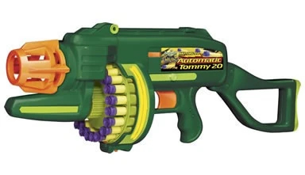
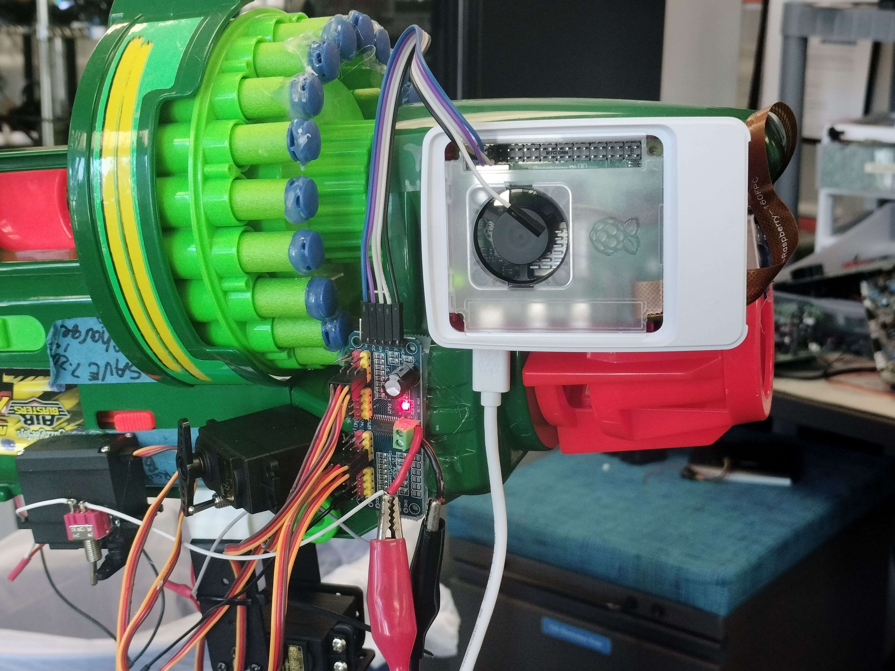

# Autonomous Drone-Targeting Dart Turret 

 

> Contributors: Kevin Foyet, Jason Molina, David Nuckolls, Rob Ranit, and Raymond Wong  
> April 2024 － May 2024  
> ECE 4300.01 － Computer Architecture

A fully-autonomous turret which can detect and fire darts at a nearby drone. You can view the full project report [here](https://docs.google.com/document/d/1pOIFu9WY_gL9sg0sMV9PNh2P3P-iyiJVVvix_5ne5tk).

**Project status:** Complete

## Project Overview:

The objective of this project is to create a fully-autonomous turret which can detect when a drone is nearby and fire one (or more) darts at it. The detection and firing control is to be managed by an on-board computer and should be able to target a drone without user interference. Since this project emphasizes the electrical systems and software, mechanical design is not a focus and thus will not be as heavily covered in this project report. 

### Goals & Criteria:
- The turret should have an on-board computer capable of running an object detection and classification algorithm (henceforth referred to as the on-board computer).
- The on-board computer should be connected to a forward-facing camera to use as a video input source for the object detection algorithm.
- The on-board computer should have control over when the turret is fired.
- The on-board computer should have control over servo motors which dictate the pitch and yaw of the assembly as a whole.
- The assembly should have at least 180 degrees of freedom along its yaw and 45 degrees of freedom along its pitch.
- As an extension of the previous two goals, the on-board computer should be able to target an object with some degree of accuracy.

### Hardware Used:
- Raspberry Pi 5 (8 GB)
- Standard Raspberry Pi camera module (shown above)
- Electronically-controlled dart gun ("Automatic Tommy 20", pictured below)
- PCA9685 Servo Driver
- 4x Servo Motors
    - Pitch Servo
    - Yaw Servo
    - 2x Servos controlling physical toggle switches

## Findings & Conclusion:
This project is generally considered a success within the team, however with plenty of room for improvement in both our software and hardware. The most obvious places improvements can be made are in how the firing is controlled (ideally, MOSFETs should be used instead of using servos to short a toggle switch) and re-training the YOLO object detection model to have a more accurate confidence.
 
However, there are also numerous points of concern that were identified early-on as potential hurdles which were ultimately achieved, contributing to the status of this project’s success. Things such as whether or not the Raspberry Pi would be able to run a YOLO object detection model at a usable frequency and if the Pi would be able to manage both the object detection and rotate the turret at the same time. Despite the initial challenges of narrowing down what hardware we would be able to get the software running on, our choice of the Raspberry Pi 5 proved to have enough resources unlike previous devices that were considered, namely the Raspberry Pi Zero. While the object recognition is not perfect, the resulting product works well enough as a proof of concept that can be refined at a later time.

### Images and Media

Click [here](https://www.youtube.com/watch?v=BIZtcLPPDtI) to view a video demonstration of this project.

 

## Team Members:
- Kevin Foyet
- Jason Molina
- David Nuckolls
- Richie (Raymond) Wong
- with contributions from Rob Ranit

### Roles and Responsibilities:
- Team Lead & Software: Raymond Wong
- YOLOv8 Implementation: Kevin Foyet
- Testing & Documentation: David Nuckolls
- Hardware Research: Jason Molina

### Project Deliverables:
- [Video Demonstration](https://www.youtube.com/watch?v=BIZtcLPPDtI)
- [Final Project Report](https://docs.google.com/document/d/1pOIFu9WY_gL9sg0sMV9PNh2P3P-iyiJVVvix_5ne5tk/)

### References:
- ["YOLOv8 Docs" *Ultralytics*](https://docs.ultralytics.com/models/yolov8/)
- ["Quick Start Guide: Raspberry Pi with Ultralytics YOLOv8" *Ultralytics*](https://docs.ultralytics.com/guides/raspberry-pi/)
- ["Adafruit PCA9685 16-Channel Servo Driver" *Adafruit Learning System*](https://learn.adafruit.com/16-channel-pwm-servo-driver/overview)
- ["CircuitPython Libraries on Linux and Raspberry Pi" *Adafruit Learning System*](https://learn.adafruit.com/circuitpython-on-raspberrypi-linux)
- ["You Only Look Once: Unified, Real-Time Object Detection" *The Computer Vision Foundation*, Digikey](https://www.cv-foundation.org/openaccess/content_cvpr_2016/papers/Redmon_You_Only_Look_CVPR_2016_paper.pdf)
