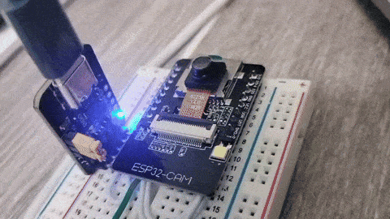
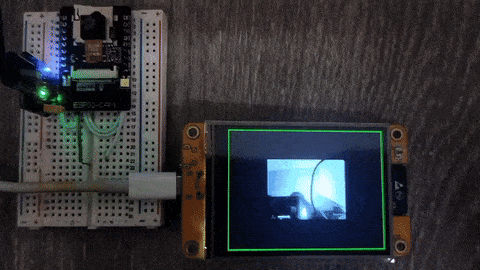
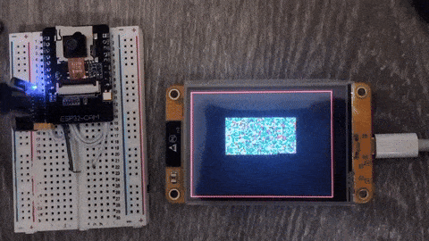
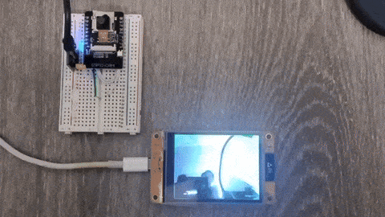
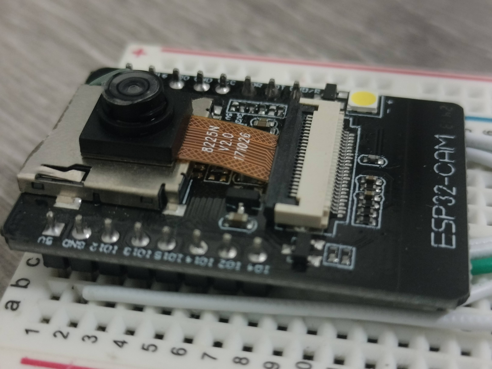
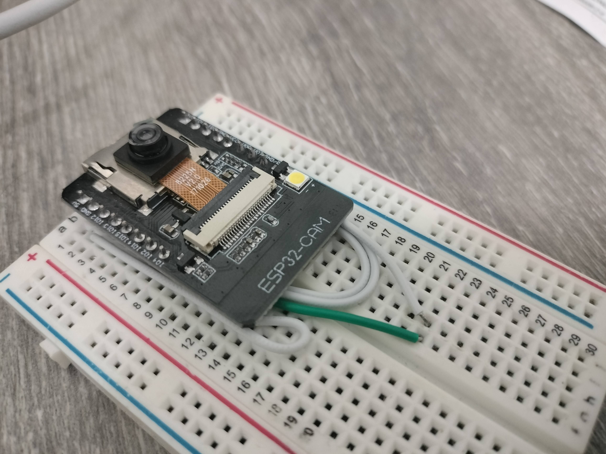
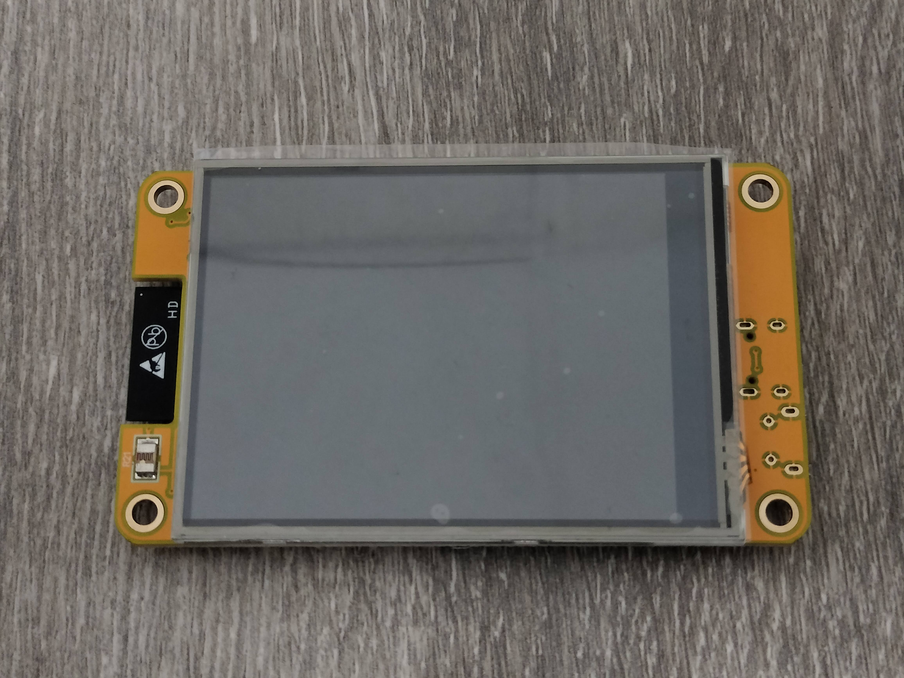
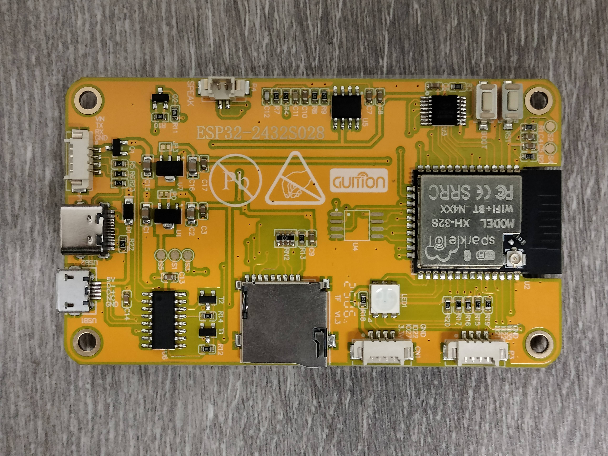

# Encrypted Video over ESP-NOW ("EVEN-4301")

    
    
    

-----

> [Cyrus Kwok](https://www.linkedin.com/in/cyrus-kwok-432351213/), [William Masri](https://www.linkedin.com/in/william-masri-797978292/), and [Raymond Wong](https://www.linkedin.com/in/raymond-exe/)  
> April 2025 － May 2025  
> ECE 4301.01 － Cryptographic Algorithms on Reconfigurable Hardware  

ECE 4301 final project. Transmitting an AES-128 encrypted JPG stream over Espressif's ESP-NOW protocol, completely run on ESP32 microcontrollers. You can view the full project repository [here](https://github.com/Raymond-exe/EVEN-4301).

**Project status:** Complete

## Slideshow Presentation
<iframe src="https://docs.google.com/presentation/d/1inJd1SBS8Le8-MSJO36JaHmavx3KHoCaNt_0PNubrFs/embed"> </iframe>

## Project Overview
The objective of this project is to design a system to transmit a secure video stream from one device to another, while limiting the hardware used to microcontrollers in the interest of keeping the system "lightweight". To achieve this, AES-128 encryption was run on ESP32s capturing and transmitting images, for other ESP32s to receive and decrypt. The Espressif ESP32 microcontroller was selected for its built-in ability to wirelessly transmit packets of information to other devices, with its own protocol for communicating with other ESP32s (ESP-NOW).

### Transmitter (Camera) Logic

*In the animation above, each green flash corresponds to one image being captured, encrypted, and transmitted over ESP-NOW.*

The transmitter first captures an image and *encodes* it as a JPG file. The JPG file is then *encrypted* using an AES-128 key before being transmitted to nearby receivers over ESP-NOW.

If multiple transmitters are live in a close proximity, they will broadcast on the same frequency and cause all nearby receivers to receive both their packets. In this case, the receiver's fallback logic should be disabled to avoid unintended interference.

### Receiver (Display) Logic

*A receiver (lower right) decrypting and displaying a 160x120 JPG feed from the nearby transmitter (upper left) at ~8 fps.*

Nearby receivers, upon receiving a packet over ESP-NOW, will attempt to use their own AES-128 key to *decrypt* and *decode* the files, in that order. If the receiver decrypts and decodes the image successfully, it is displayed in the center of the screen. If the receiver encounters an error after receiving a packet, fallback logic (detailed below) is run instead.

Additionally, receivers will display different border colors depending on connection status: 
- A **Green** border will be displayed if a packet was decrypted, decoded, and displayed successfully.
- A **Yellow** border will be displayed every 10 seconds, to show that the image currently displayed was received an unusually long time ago. In normal (green) operation, this border is quickly overwritten.
- A **Red** border will be displayed if a packet was received but decryption failed or resulted in a file which cannot be decoded (fallback logic).

#### Receiver Fallback Logic

If either the decrypt or decode processes fail, the receiver resorts to a fall-back display option, displaying all bytes of the recieved packet (before decryption/decoding) on the screen as RGB 3x3 pixels. Each 3x3 pixel square represents one byte, reading the byte in the R-G-B 3-3-2 bit pattern. This fallback logic **can be disabled**, but is useful during testing and debugging.

A neat visualization as a result of JPG compression is that covering the sensor will actually cause the file size to shrink, also decreasing the number of 3x3 pixel squares displayed during the fallback logic.

### Encryption

For AES-128 encryption and decryption, Espressif's mbedtls component is used in order to take advantage of the ESP32's AES hardware acceleration. This hardware acceleration is used on both the transmitter and receiver ESP32's, in order to free up clock cycles for other operations being performed simultaneously.

To avoid the receiver running its fallback render logic, both the transmitter and receiver must have **matching AES-128 keys**. However, if there are multiple transmitters in a close proximity, using different keys for each transmitter-receiver pair (and disabling the receiver's fallback logic) can be a simple way to run multiple transmitter-receiver setups without interference.

## Performance Metrics
| Render Res | | TX Capture Time | | RX Render Time | | TX Current Draw | | TX Power Consumption |
| ---------- |-| --------------- |-| -------------- |-| --------------- |-| -------------------- |
| 320 x 240  | |   270 - 320 ms  | |  120 - 128 ms  | |   0.16 - 0.3 A  | |    0.82 - 1.54 W     |
| 160 x 120  | |   190 - 210 ms  | |   30 - 33 ms   | |  0.16 - 0.23 A  | |    0.82 - 1.18 W     |

According to the metrics recorded during testing, the current major bottleneck is with the time the transmitter takes to capture and transmit an image. At full resolution (320x240) the transmitter can capture and transmit 3 frames per second (fps), a little lower than the receiver's ability to render at **8 fps**. The transmitter performs moderately better one-quarter resolution (160x120), being able to transmit **5 fps**. However, the receiver gains a massive performance boost when rendering at 160x120, able to receive, decrypt, and render images at **~30 fps**.

The frames per second (fps) are calculated by dividing 1000 ms by the total capture or render time.

Further testing would be needed to determine which operation performed by the transmitter (capture/encode/encrypt/transmit) takes the longest, and possible ways to further optimize its operations.

## Timeline
**Gantt Chart**

Research & hardware purchases: *April 07 - April 14*  
Software development & debugging: *April 14 - April 28*  
Final testing & implementation: *April 29 - May 08*  

**Completed by the weekend of May 9**

## Project Resources
 

### Hardware
- Transmitter ("TX") - [Inland ESP32-CAM](https://www.microcenter.com/product/632692/inland-esp32-cam-wifi-bluetooth-camera-modules-pair)
- Receiver ("RX") - [ESP32 + ILI9341 "Cheap Yellow Display"](https://www.amazon.com/gp/product/B0CG2WQGP9)

The specific ESP32 modules listed above are not required in order to re-create this project, however this project was originally developed with these microcontrollers in mind. Using other ESP32's may require reconfiguring certain settings or redeveloping this software entirely.

### Software
- hpsaturn's [ESPNowCam](https://github.com/hpsaturn/ESPNowCam) library
- Paul Stoffregen [XPT2046 Touchscreen](https://github.com/PaulStoffregen/XPT2046_Touchscreen) library
- Bodmer's [TFT_eSPI](https://github.com/Bodmer/TFT_eSPI) library
- Bodmer's [JPEG Decoder](https://github.com/Bodmer/JPEGDecoder) library

### Images and Media

