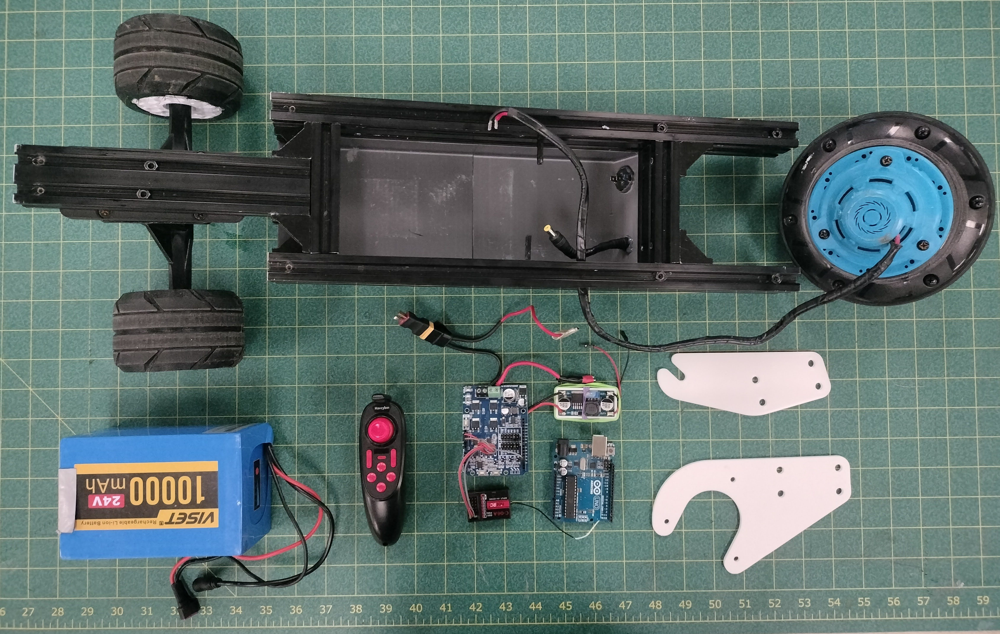

# Electric Longboard

    
    

A custom electric longboard created from scratch. Built around an Arduino Uno and motor shield, the electrical system is designed to run on 24 volts and is controlled from a small R/C transmitter.

**Project status:** Complete, awaiting [possible upgrades](#future-opportunities)

## Project Overview

### Mechanical Components:
- '2040' Aluminum beams
- 1/4" Acrylic Deck
- Longboard truck
- 3D printed Longboard wheels
- 3D printed undercarriage
- Aluminum wheel mount

### Electrical Components:
- Arduino Uno
- [Cytron 10A Motor Shield-MD10](https://www.cytron.io/p-10amp-7v-30v-dc-motor-driver-shield-for-arduino)
- Small R/C receiver + Remote
- 24V -> 5V buck converter
- Hub wheel motor

### Control System Information:
The control system as a whole is built around the Arduino Uno, which the motor shield is mounted on top of. The R/C receiver and the Uno both run on 5 volts, thus a buck converter is necessary to step the 24V power down to 5V. The 24V battery powers the buck converter and the motor shield, which modulates a PWM signal to scale the 24 volts down to a value between 0 and 24. The PWM signal then powers the main motor, mounted at the back of the board.

The firmware on the Arduino reads the PWM signal from channel 2 of the R/C reciever (connected to the vertical axis for the joystick on the transmitter) and increases or decreases the PWM signal sent to the motor, effectively allowing the rider to control the board's acceleration. The internal friction of the hub motor is high enough for a decrease in the PWM signal to result in the wheel braking, although this is a notable flaw in the efficiency of the hub motor.

## Future Opportunities
There are several minor flaws with the board I'd want to address in future upgrades, namely:
1. **Low power output:**
    - While the motor is powerful enough to propel myself and the board, it tends to struggle on aggressive inclines and frankly doesn't have an ideal top speed. Replacing the DC motor with a 3-phase motor would have a higher power efficiency, however it would also require redesigning the control system, as the motor shield currently used is only designed for DC motors. On the other hand, a system redesign would also allow me to use a higher-voltage battery for a better power output and would allow me to switch away from an Arduino microcontroller to using an ESP32, which would then allow me to integrate a form of telemetry.
2. **Adding telemetry via bluetooth:**
    - A minor annoyance with the current iteration of the electric longboard is that despite being able to control the speed via R/C transmitter, the true voltage and current draw of the motor is not easily measurable (without a high-voltage multimeter). Thus, a current sensor can be placed along one of the signal wires of a 3-phase motor (replacing the DC motor currently used, as established above) to read and report approximately how much power the motor is drawing at any given moment.
3. **Moisture forming inside the electronics bay:**
    - Telemetry via the ESP32's bluetooth also allows for other system diagnostics to be reported, such as the internal environment of the electronics bay. When raining or misting outside, the warm internal temperature of the electronics bay causes droplets to form at the top surface, risking a short-circuit and loss of control if a droplet were to fall onto any of the electrical components. While it may be difficult to entirely prevent moisture from entering without also cutting off all airflow, this issue can be mitigated by placing temperature and humidity sensors on the inside of the bay, and sending warnings via telemetry. A [DHT22](https://www.adafruit.com/product/385) sensor will most likely be used for measuring the air metrics, and a simple high-amperage resistor can be used to measure the current.
4. **Structural Integrity:**
    - A flaw with the way the 2040 aluminum beams are connected results in unintended stress on the acrylic deck on top of the frame. While the frame and deck together can withstand at least 140 lbs of force, a sudden shock load targeted about 1 foot from the front edge of the deck can result in cracks forming in the deck and slight bending in the frame. The frame's bend happens due to a weak connection between the beam secured to the forward longboard truck and the other beams connected to the electronics bay and rear hub motor. A redesign would allow me to restructure (or even entirely replace) the frame and eliminate the weak point by instead using two aluminum beams connected to both the forward longboard truck *and* the rear hub motor, rather than multiple beams connected to each.

## Gallery

