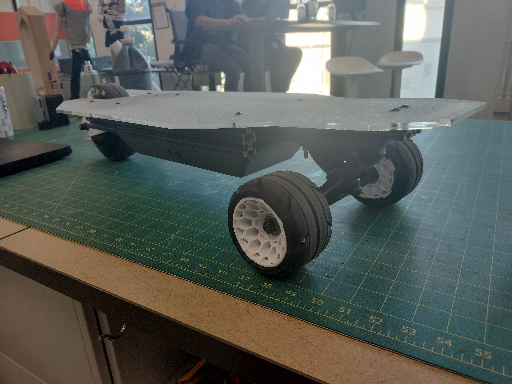
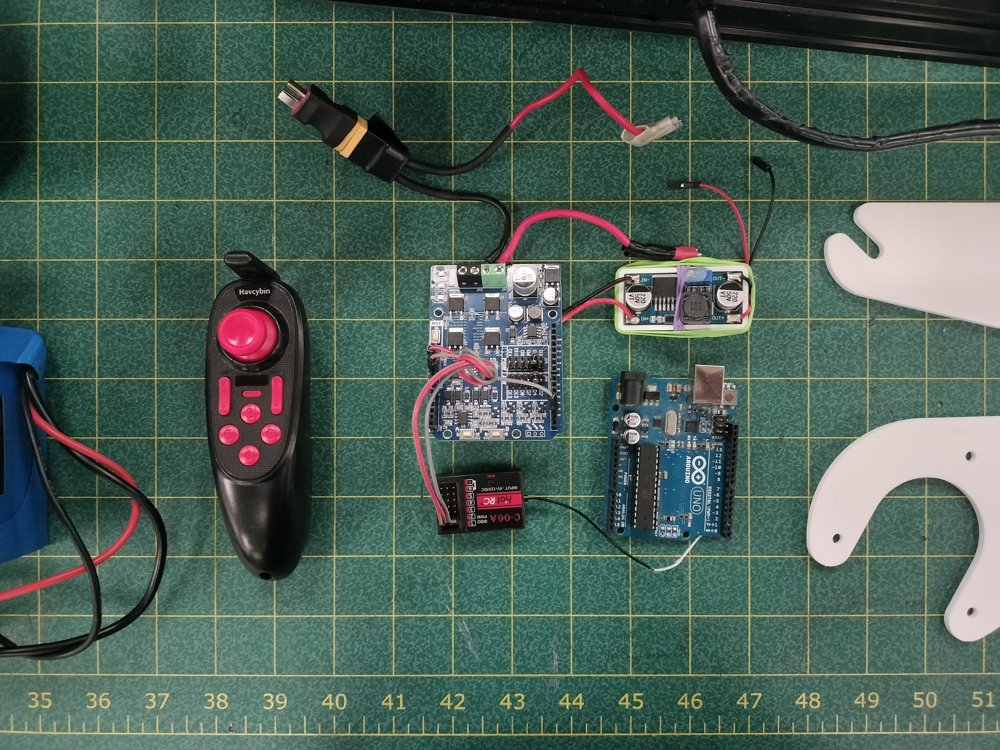

# Electric Longboard

A custom electric longboard created from scratch.

*More information to follow, this overview is not yet complete.

**Project status:** In Testing

## Mechanical Details

### Components
- '2040' Aluminum beams
- 1/4" Acrylic Deck
- Longboard truck
- 3D printed undercarriage
- 3D printed wheel mount
  - To be replaced with aluminum

## Electrical Details

### Components
- Arduino Uno
- Cytron 10A Motor Shield-MD10
- Small R/C receiver + Remote
- 24V -> 5V buck converter
- Hub wheel motor

### System Information

The control system as a whole is built around the Arduino Uno, which the motor shield is mounted on top of. The R/C receiver and the Uno both run on 5 volts, thus a buck converter is necessary to step the 24V power down to 5V. The 24V battery powers the buck converter and the motor shield, which modulates a PWM signal to scale the 24 volts down to a value between 0 and 24. The PWM signal then powers the main motor, mounted at the back of the board.

## Future Opportunities
In the future, I hope to replace the Arduino Uno with an ESP32 in the same form factor, both for personal experience and to use the on-board WiFi/Bluetooth communication in order to transmit telemetry data to my phone while riding it. Finding a more efficient hub motor is also a goal, however is not currently the highest priority. Lastly, allowing air to flow safely through the electronics bay may help control the internal temperature, but the possibility of foreign objects and water getting inside are also a major concern.

### Telemetry upgrade
Switching to the ESP32 presents the opportunity to transmit system diagnostics for debugging and health monitoring. I'm specifically interested in the air temperature and air moisture content inside of the electrionics bay, although the voltage and amperage drawn by the motor are also points of interest I'd like to add. A [DHT22](https://www.adafruit.com/product/385) will likely be used for measuring the air metrics, and a simple high-amperage resistor can be used to measure the current.

## Gallery

