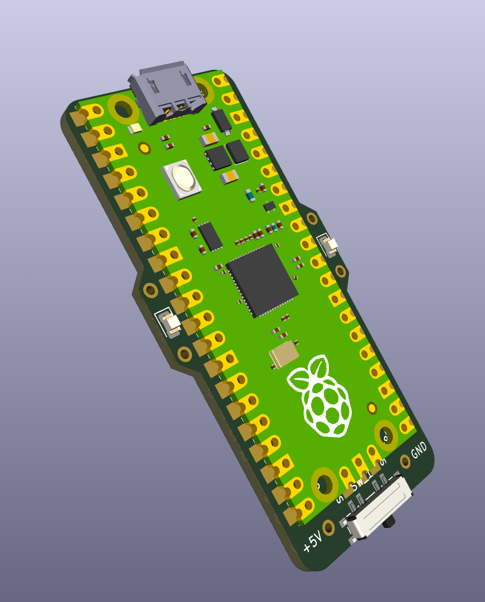
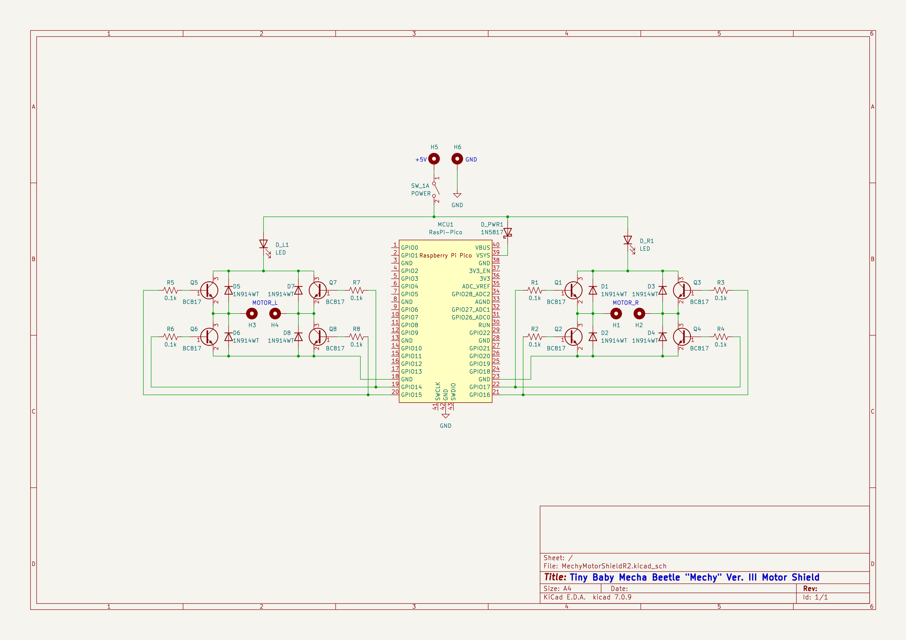

# "Mechy" - A mini motor shield for the Raspberry Pi Pico

    
    
    <!--  -->

*Mechy* Ver. III is my first PCB design project. The goal is to create a remote-controllable device capable of driving itself around, while also making it as small as possible.

**Project status:** Project On Hold until Senior Design Project is completed

## Background
### Why call the project "Mechy"?
The nickname "mechy" refers to the team of *Mechanical Engineers* (Mech-E's) who created the first iteration of this, originally called the "Tiny Baby Mecha Beetle".

### Why is this Version III?
Earlier versions of this project didn't use a PCB at all - in fact, the first version was made using just 2 motors and a battery. The second iteration included a Raspberry Pi Pico and an HC-05 bluetooth module, but the weight of the HC-05 combined with the excess wiring created a messy (but working) circuit.

Version III is a nearly complete revision of the project. The motors, the wiring, and even the Microcontroller board have all been updated. All wiring is replaced with a single custom PCB, visible below. Using a PCB over wiring reduces the mass of the device, decreases the physical footprint, and even allows space a more complex circuit. A bluetooth module is no longer required, as the Pico W (replacing the Pico) features on-board bluetooth low-energy (BLE) communication.

### Circuit information
The Mechy motor shield is a 2-sided PCB, with one side ("side A") dedicated to mounting the Pico or Pico W. The back side ("side B") contains two H-bridge circuits for driving two separate motors, which may be soldered to the left and right points of the board. A 5V battery is required to power the circuit, and can be connected +5V and GND pins next to the power switch at the bottom of the board. For upkeep purposes, an intermediary charging board is recommended.

## Gallery

